# Link Studio Director Ultra Design System

You are building UI for **Link Studio Director Ultra**. Dark-themed, neutral palette, sans-serif typography (Segoe UI Variable), compact density on a 4px grid, flat elevation (no shadows).

## Visual Reference

**IMPORTANT**: Study ALL screenshots below before writing any UI. Match colors, typography, spacing, layout, and motion exactly as shown.

### Scroll Journey (Cinematic Visual States)

> These screenshots capture the website at different scroll depths. The design changes dramatically as you scroll — each frame shows a different cinematic state. Replicate these exact visual transitions.

#### 0% — Hero / Above the fold


#### 17% — Mid-page at 17% scroll


#### 33% — Mid-page at 33% scroll


#### 50% — Mid-page at 50% scroll


#### 67% — Mid-page at 67% scroll


#### 83% — Mid-page at 83% scroll


#### 100% — Footer / End of page

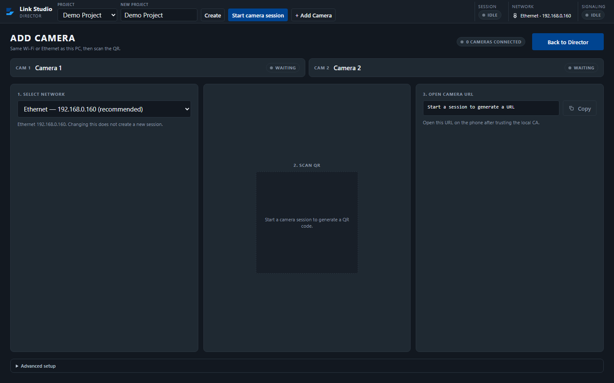

> Read `references/DESIGN.md` for full token details. Read `references/ANIMATIONS.md` for motion specs. Read `references/LAYOUT.md` for layout structure. Read `references/COMPONENTS.md` for component patterns.

## Ultra Reference Files

This package includes extended documentation. **Read these files before implementing:**

| File | Contents |
|------|----------|
| `references/DESIGN.md` | Full design system tokens, colors, typography, spacing |
| `references/VISUAL_GUIDE.md` | **START HERE** — Master visual guide with all screenshots embedded |
| `references/ANIMATIONS.md` | CSS keyframes, scroll triggers, motion library stack, video specs |
| `references/LAYOUT.md` | Flex/grid containers, page structure, spacing relationships |
| `references/COMPONENTS.md` | DOM component patterns, HTML structure, class fingerprints |
| `references/INTERACTIONS.md` | Hover/focus states with before/after style diffs |
| `screens/scroll/` | 7 scroll journey screenshots showing cinematic states |

## Design Philosophy

- **Flat elevation** — depth through color shifts and borders, never shadows. Surfaces get progressively lighter to indicate elevation.
- **Solid colors only** — no gradients anywhere. Every surface is a single flat color.
- **Single typeface** — Segoe UI Variable carries all text. Hierarchy comes from size, weight, and color — never font mixing.
- **compact density** — 4px base grid. Every dimension is a multiple of 4.
- **neutral palette** — the color temperature runs neutral, matching the sans-serif typography.
- **Restrained accent** — `#b7c3cf` is the only pop of color. Used exclusively for CTAs, links, focus rings, and active states.
- **Minimal motion** — prefer instant state changes. Only use transitions for loading and page transitions.

## Color System

### Core Palette

| Role | Token | Hex | Use |
|------|-------|-----|-----|
| Background | `--background` | `#2a3540` | Page/app background |
| Surface | `--surface` | `#1f2932` | Cards, panels, modals |
| Text Primary | `--text-primary` | `#eef2f6` | Headings, body text |
| Text Muted | `--text-muted` | `#8a97a6` | Captions, placeholders |
| Accent | `--accent` | `#b7c3cf` | CTAs, links, focus rings |

### Extended Palette

- `#121820` — Deep background layer or shadow color
- `#6b7784`
- `#ffffff` — Light surface or highlight color
- `#07090c` — Deep background layer or shadow color
- `#004490`
- `#000000` — Deep background layer or shadow color

### CSS Variable Tokens

```css
--blue-accent: #1e9dfe;
--paper-card: #ffffff;
--border: #2a3540;
--text-secondary: #b7c3cf;
--muted: #8a97a6;
--primary: var(--blue-navy);
--secondary: var(--blue-mid);
--accent: var(--blue-accent);
```

## Typography

### Font Stack

- **Segoe UI Variable** — Heading 1, Heading 2, Heading 3, Body, Caption

### Type Scale

| Role | Family | Size | Weight |
|------|--------|------|--------|
| Heading 1 | Segoe UI Variable | 48px / 3rem | 700 |
| Heading 2 | Segoe UI Variable | 32px / 2rem | 600 |
| Heading 3 | Segoe UI Variable | 24px / 1.5rem | 600 |
| Body | Segoe UI Variable | 16px / 1rem | 400 |
| Caption | Segoe UI Variable | 12px / 0.75rem | 400 |

### Typography Rules

- All text uses **Segoe UI Variable** — never add another font family
- Max 3-4 font sizes per screen
- Headings: weight 600-700, body: weight 400
- Use color and opacity for text hierarchy, not additional font sizes
- Line height: 1.5 for body, 1.2 for headings

## Spacing & Layout

### Base Grid: 4px

Every dimension (margin, padding, gap, width, height) must be a multiple of **4px**.

### Spacing Scale

`2, 4, 6, 8, 10, 12, 16, 20, 24` px

### Spacing as Meaning

| Spacing | Use |
|---------|-----|
| 4-8px | Tight: related items (icon + label, avatar + name) |
| 12-16px | Medium: between groups within a section |
| 24-32px | Wide: between distinct sections |
| 48px+ | Vast: major page section breaks |

### Border Radius

Scale: `4px, 8px, 999px`
Default: `8px`

## Component Patterns

### Card

```css
.card {
  background: #1f2932;
  border-radius: 8px;
  padding: 16px;
}
```

```html
<div class="card">
  <h3>Card Title</h3>
  <p>Card content goes here.</p>
</div>
```

### Button

```css
/* Primary */
.btn-primary {
  background: #b7c3cf;
  color: #eef2f6;
  border-radius: 8px;
  padding: 8px 16px;
  font-weight: 500;
  transition: opacity 150ms ease;
}
.btn-primary:hover { opacity: 0.9; }

/* Ghost */
.btn-ghost {
  background: transparent;
  border: 1px solid #444444;
  color: #eef2f6;
  border-radius: 8px;
  padding: 8px 16px;
}
```

```html
<button class="btn-primary">Get Started</button>
<button class="btn-ghost">Learn More</button>
```

### Input

```css
.input {
  background: #2a3540;
  border: 1px solid #444444;
  border-radius: 8px;
  padding: 8px 12px;
  color: #eef2f6;
  font-size: 14px;
}
.input:focus { border-color: #b7c3cf; outline: none; }
```

```html
<input class="input" type="text" placeholder="Search..." />
```

### Badge / Chip

```css
.badge {
  display: inline-flex;
  align-items: center;
  padding: 4px 8px;
  border-radius: 9999px;
  font-size: 12px;
  font-weight: 500;
  background: #1f2932;
  color: #8a97a6;
}
```

```html
<span class="badge">New</span>
<span class="badge">Beta</span>
```

### Modal / Dialog

```css
.modal-backdrop { background: rgba(0, 0, 0, 0.6); }
.modal {
  background: #1f2932;
  border-radius: 999px;
  padding: 24px;
  max-width: 480px;
  width: 90vw;
}
```

```html
<div class="modal-backdrop">
  <div class="modal">
    <h2>Dialog Title</h2>
    <p>Dialog content.</p>
    <button class="btn-primary">Confirm</button>
    <button class="btn-ghost">Cancel</button>
  </div>
</div>
```

### Table

```css
.table { width: 100%; border-collapse: collapse; }
.table th {
  text-align: left;
  padding: 8px 12px;
  font-weight: 500;
  font-size: 12px;
  color: #8a97a6;
  text-transform: uppercase;
  letter-spacing: 0.05em;
  border-bottom: 1px solid #444444;
}
.table td {
  padding: 12px;
  border-bottom: 1px solid #444444;
}
```

```html
<table class="table">
  <thead><tr><th>Name</th><th>Status</th><th>Date</th></tr></thead>
  <tbody>
    <tr><td>Item One</td><td>Active</td><td>Jan 1</td></tr>
    <tr><td>Item Two</td><td>Pending</td><td>Jan 2</td></tr>
  </tbody>
</table>
```

### Navigation

```css
.nav {
  display: flex;
  align-items: center;
  gap: 8px;
  padding: 12px 16px;
}
.nav-link {
  color: #8a97a6;
  padding: 8px 12px;
  border-radius: 8px;
  transition: color 150ms;
}
.nav-link:hover { color: #eef2f6; }
.nav-link.active { color: #b7c3cf; }
```

```html
<nav class="nav">
  <a href="/" class="nav-link active">Home</a>
  <a href="/about" class="nav-link">About</a>
  <a href="/pricing" class="nav-link">Pricing</a>
  <button class="btn-primary" style="margin-left: auto">Get Started</button>
</nav>
```

## Animation & Motion

This project uses **subtle motion**. Transitions smooth state changes without calling attention.

### Motion Guidelines

- **Duration:** 150-300ms for micro-interactions, 300-500ms for page transitions
- **Easing:** `ease-out` for enters, `ease-in` for exits
- **Direction:** Elements enter from bottom/right, exit to top/left
- **Reduced motion:** Always respect `prefers-reduced-motion` — disable animations when set

## Depth & Elevation

This design uses **flat elevation** — no box-shadows anywhere.

### Elevation Strategy

| Level | Technique | Use |
|-------|-----------|-----|
| 0 — Base | Background color | Page background |
| 1 — Raised | Lighter surface + subtle border | Cards, panels |
| 2 — Floating | Even lighter surface + stronger border | Dropdowns, popovers |
| 3 — Overlay | Backdrop + modal surface | Modals, dialogs |

## Anti-Patterns (Never Do)

- **No box-shadow** on any element — use borders and surface colors for depth
- **No gradients** — solid colors only, everywhere
- **No blur effects** — no backdrop-blur, no filter: blur()
- **No zebra striping** — tables and lists use borders for separation
- **No invented colors** — every hex value must come from the palette above
- **No arbitrary spacing** — every dimension is a multiple of 4px
- **No extra fonts** — only Segoe UI Variable are allowed
- **No arbitrary border-radius** — use the scale: 4px, 8px, 999px
- **No opacity for disabled states** — use muted colors instead

## Workflow

1. **Read** `references/DESIGN.md` before writing any UI code
2. **Pick colors** from the Color System section — never invent new ones
3. **Set typography** — Segoe UI Variable only, using the type scale
4. **Build layout** on the 4px grid — check every margin, padding, gap
5. **Match components** to patterns above before creating new ones
6. **Apply elevation** — flat, surface color shifts only
7. **Validate** — every value traces back to a design token. No magic numbers.

## Brand Spec

- **Favicon:** `/logo.svg`
- **Site URL:** `http://localhost:1420`
- **Brand color:** `#b7c3cf`
- **Brand typeface:** Segoe UI Variable

## Quick Reference

```
Background:     #2a3540
Surface:        #1f2932
Text:           #eef2f6 / #8a97a6
Accent:         #b7c3cf
Border:         (not extracted)
Font:           Segoe UI Variable
Spacing:        4px grid
Radius:         8px
Components:     0 detected
```

## When to Trigger

Activate this skill when:
- Creating new components, pages, or visual elements for Link Studio Director Ultra
- Writing CSS, Tailwind classes, styled-components, or inline styles
- Building page layouts, templates, or responsive designs
- Reviewing UI code for design consistency
- The user mentions "Link Studio Director Ultra" design, style, UI, or theme
- Generating mockups, wireframes, or visual prototypes

---

# Full Reference Files

> Every output file is embedded below. Claude has full design system context from /skills alone.

## Design System Tokens (DESIGN.md)

# Link Studio Director Ultra DESIGN.md

> Auto-generated design system — reverse-engineered via static analysis by skillui.
> Frameworks: None detected
> Colors: 11 · Fonts: 1 · Components: 0
> Icon library: not detected · State: not detected
> Primary theme: dark · Dark mode toggle: no · Motion: none

---

## 1. Visual Theme & Atmosphere

This is a **dark-themed** interface with a flat, neutral visual language. Elevation is achieved through color and border shifts rather than shadows — a clean, industrial aesthetic. Typography uses **Segoe UI Variable** throughout — a clean, modern choice that maintains consistency. Spacing follows a **4px base grid** (compact density), with scale: 2, 4, 6, 8, 10, 12, 16, 20px. The palette is predominantly monochromatic with **#b7c3cf** as the single accent color — used sparingly for interactive elements and emphasis.

---

## 2. Color Palette & Roles

| Token | Hex | Role | Use |
|---|---|---|---|
| background | `#2a3540` | background | Page background, darkest surface |
| surface | `#1f2932` | surface | Card and panel backgrounds |
| text-primary | `#eef2f6` | text-primary | Headings and body text |
| text-muted | `#8a97a6` | text-muted | Captions, placeholders, secondary info |
| accent | `#b7c3cf` | accent | CTAs, links, focus rings, active states |
| info | `#004490` | info | Informational highlights |
| unknown | `#121820` | unknown | Palette color |
| unknown | `#6b7784` | unknown | Palette color |
| unknown | `#ffffff` | unknown | Palette color |
| unknown | `#07090c` | unknown | Palette color |
| unknown | `#000000` | unknown | Palette color |

### CSS Variable Tokens

```css
--blue-accent: #1e9dfe;
--paper-card: #ffffff;
--border: #2a3540;
--text-secondary: #b7c3cf;
--muted: #8a97a6;
--primary: var(--blue-navy);
--secondary: var(--blue-mid);
--accent: var(--blue-accent);
```


---

## 3. Typography Rules

**Font Stack:**
- **Segoe UI Variable** — Heading 1, Heading 2, Heading 3, Body, Caption

| Role | Font | Size | Weight |
|---|---|---|---|
| Heading 1 | Segoe UI Variable | 48px / 3rem | 700 |
| Heading 2 | Segoe UI Variable | 32px / 2rem | 600 |
| Heading 3 | Segoe UI Variable | 24px / 1.5rem | 600 |
| Body | Segoe UI Variable | 16px / 1rem | 400 |
| Caption | Segoe UI Variable | 12px / 0.75rem | 400 |

**Typographic Rules:**
- Use **Segoe UI Variable** for all text — do not mix font families
- Maintain consistent hierarchy: no more than 3-4 font sizes per screen
- Headings use bold (600-700), body uses regular (400)
- Line height: 1.5 for body text, 1.2 for headings
- Use color and opacity for secondary hierarchy, not additional font sizes


---

## 4. Component Stylings

No components detected. Scan `src/components/` or `components/` to populate this section.

---

## 5. Layout Principles

- **Base spacing unit:** 4px
- **Spacing scale:** 2, 4, 6, 8, 10, 12, 16, 20, 24
- **Border radius:** 4px, 8px, 999px

**Spacing as Meaning:**
| Spacing | Use |
|---|---|
| 4-8px | Tight: related items within a group |
| 12-16px | Medium: between groups |
| 24-32px | Wide: between sections |
| 48px+ | Vast: major section breaks |


---

## 6. Depth & Elevation

No box-shadow values detected. The design uses a **flat visual style** — elevation is conveyed through background color shifts and borders rather than shadows.

**Elevation Strategy:**
| Level | Technique | Use |
|---|---|---|
| 0 — Base | Background color | Page background |
| 1 — Raised | Lighter surface + subtle border | Cards, panels |
| 2 — Floating | Even lighter surface + stronger border | Dropdowns, popovers |
| 3 — Overlay | Backdrop + modal surface | Modals, dialogs |


---

## 8. Do's and Don'ts

### Do's

- Use `#b7c3cf` for interactive elements (buttons, links, focus rings)
- Use `#2a3540` as the primary page background
- Use **Segoe UI Variable** for all UI text
- Follow the **4px** spacing grid for all margins, padding, and gaps
- Use border and background shifts for elevation — not shadows
- Use border-radius from the scale: 4px, 8px, 999px

### Don'ts

- Don't introduce colors outside this palette — extend the design tokens first
- Don't mix font families — use Segoe UI Variable consistently
- Don't use arbitrary spacing values — stick to multiples of 4px
- Don't add box-shadow — this design system uses flat elevation
- Don't use gradients — the design uses solid colors only
- Don't use arbitrary border-radius values — pick from the defined scale
- Don't use backdrop-blur or blur effects

### Anti-Patterns (detected from codebase)

- No box-shadow on any element
- No gradient backgrounds
- No blur or backdrop-blur effects
- No zebra striping on tables/lists


---

## 9. Responsive Behavior

No breakpoints detected. Consider adding responsive breakpoints to the design system.

---

## 10. Agent Prompt Guide

Use these as starting points when building new UI:

### Build a Card

```
Background: #1f2932
Border: 1px solid var(--border)
Radius: 8px
Padding: 16px
Font: Segoe UI Variable
No shadows — use borders and surface colors for depth.
```

### Build a Button

```
Primary: bg #b7c3cf, text white
Ghost: bg transparent, border var(--border)
Padding: 8px 16px
Radius: 8px
Hover: opacity 0.9 or lighter shade
Focus: ring with #b7c3cf
```

### Build a Page Layout

```
Background: #2a3540
Max-width: 1280px, centered
Grid: 4px base
Responsive: mobile-first, breakpoints from Section 9
```

### Build a Stats Card

```
Surface: #1f2932
Label: #8a97a6 (muted, 12px, uppercase)
Value: #eef2f6 (primary, 24-32px, bold)
Status: use success/warning/danger from Section 2
```

### Build a Form

```
Input bg: #2a3540
Input border: 1px solid var(--border)
Focus: border-color #b7c3cf
Label: #8a97a6 12px
Spacing: 16px between fields
Radius: 8px
```

### General Component

```
1. Read DESIGN.md Sections 2-6 for tokens
2. Colors: only from palette
3. Font: Segoe UI Variable, type scale from Section 3
4. Spacing: 4px grid
5. Components: match patterns from Section 4
6. Elevation: flat, surface shifts
```

## Visual Guide — Screenshots (VISUAL_GUIDE.md)

# Link Studio Director Ultra — Visual Guide

> Master visual reference. Study every screenshot carefully before implementing any UI.
> Match colors, layout, typography, spacing, and motion states exactly.

## Scroll Journey

The page has cinematic scroll animations. Each screenshot below shows the exact visual state at that scroll depth.
**Replicate these transitions precisely** — the design changes dramatically as you scroll.

### Hero — Above the fold

*Scroll position: 0px of 900px total*


### 17% scroll depth

*Scroll position: 0px of 900px total*


### 33% scroll depth

*Scroll position: 0px of 900px total*


### 50% scroll depth

*Scroll position: 0px of 900px total*


### 67% scroll depth

*Scroll position: 0px of 900px total*


### 83% scroll depth

*Scroll position: 0px of 900px total*


### Footer — End of page

*Scroll position: 0px of 900px total*


## Full Page Screenshots

### Link Studio

*URL: `http://localhost:1420`*


## Section Screenshots

Clipped sections showing individual components in context.

### Section 1 — `section`

*1440×845px*


## Animations & Motion (ANIMATIONS.md)

# Animation Reference

> Cinematic motion design extracted from live DOM. Follow these specs exactly to recreate the experience.

## Motion Technology Stack

Pure CSS animations — no external animation libraries detected.

## Scroll Journey

The page is **900px** tall. Each frame below shows what the user sees at that scroll depth.

> **Use these screenshots to understand WHAT animates, WHEN it animates, and HOW it moves.**

### 0% — Top / Hero
Scroll position: 0px


### 17% — Opening Section
Scroll position: 0px


### 33% — First Feature Section
Scroll position: 0px


### 50% — Mid-Page
Scroll position: 0px


### 67% — Lower Content
Scroll position: 0px


### 83% — Near Footer
Scroll position: 0px


### 100% — Bottom / Footer
Scroll position: 0px


## Motion Tokens (CSS Variables)

### Easing Tokens

```css
--ease: cubic-bezier(0.2, 0.8, 0.2, 1);
```

## Global Transition Declarations

These `transition` values were extracted from CSS rules across the site:

```css
transition: background var(--dur) var(--ease), border-color var(--dur) var(--ease), opacity var(--dur) var(--ease);
```

## How to Recreate This Motion Design

### Step 2 — Scroll-Reveal Pattern

Elements that animate into view follow this pattern:

```css
/* Initial hidden state */
.reveal {
  opacity: 0;
  transform: translateY(40px);
  transition: opacity 0.6s cubic-bezier(0.2, 0.8, 0.2, 1),
              transform 0.6s cubic-bezier(0.2, 0.8, 0.2, 1);
}
.reveal.visible {
  opacity: 1;
  transform: translateY(0);
}
```

### Step 3 — Key Motion Principles

- **Always add** `@media (prefers-reduced-motion: reduce) { * { animation-duration: 0.01ms !important; transition-duration: 0.01ms !important; } }`

### Step 4 — Scroll Journey Reference

Match what happens at each scroll position:

- **0%** (`0px`) → `screens/scroll/scroll-000.png`
- **17%** (`0px`) → `screens/scroll/scroll-017.png`
- **33%** (`0px`) → `screens/scroll/scroll-033.png`
- **50%** (`0px`) → `screens/scroll/scroll-050.png`
- **67%** (`0px`) → `screens/scroll/scroll-067.png`
- **83%** (`0px`) → `screens/scroll/scroll-083.png`
- **100%** (`0px`) → `screens/scroll/scroll-100.png`

## Layout & Grid (LAYOUT.md)

# Layout Reference

> Auto-extracted from live DOM. Use this to understand how the site is structured spatially.

## Spacing System

**Base grid:** 4px

**Scale:** `2, 4, 6, 8, 10, 12, 16, 20, 24` px

| Spacing | Semantic Use |
|---------|-------------|
| 4px | Tight — within a component |
| 8px | Medium — between sibling items |
| 16px | Wide — between sections |
| 32px | Vast — major section breaks |

## Flex Layouts

| Element | Direction | Justify | Align | Gap | Children |
|---------|-----------|---------|-------|-----|----------|
| `div.chrome-row` | row | — | center | 12px | 3 |
| `div.url-row` | row | — | start | 8px | 2 |

## Grid Layouts

| Element | Template Columns | Gap | Children |
|---------|-----------------|-----|----------|
| `header.chrome` | `1416px` | 4px | 1 |
| `section#camera-connection.connection-stage` | `1392px` | 16px | 4 |

## Structural Containers

### `<header>` (`header.chrome`)

```
display:          grid
grid-template-columns: 1416px
gap:              4px
padding:          4px 12px
children:         1
```

### `<section>` (`section#camera-connection.connection-stage`)

```
display:          grid
grid-template-columns: 1392px
gap:              16px
padding:          20px 24px 24px
children:         4
```

## Layout Rules

- Primary layout system: **Flexbox**
- Secondary layout system: **CSS Grid** (used for card grids and multi-column layouts)
- Every spacing value must be a multiple of **4px**
- Never use arbitrary margin/padding values outside the spacing scale

## Component Patterns (COMPONENTS.md)

# Component Reference

> Repeated DOM patterns detected by structural analysis. Each component appeared 3+ times.

## Detected Components

| Component | Category | Instances | Key Classes |
|-----------|----------|-----------|-------------|
| **Status Chip** | badge | 5× | `.status-chip`, `.status-chip--offline` |
| **Mono** | unknown | 4× | `.mono` |
| **Btn** | button | 3× | `.btn`, `.btn-ghost` |
| **Status Unit** | unknown | 3× | `.status-unit` |

## Buttons

### Btn

**Instances found:** 3

**CSS classes:** `.btn` `.btn-ghost`

**HTML structure:**

```html
<button type="submit" class="btn btn-ghost">Create</button>
```

**Base styles (from design tokens):**

```css
.btn {
  background: #b7c3cf;
  color: #eef2f6;
  border-radius: 8px;
  padding: 4px 8px;
  cursor: pointer;
}```

## Badges & Chips

### Status Chip

**Instances found:** 5

**CSS classes:** `.status-chip` `.status-chip--offline`

**HTML structure:**

```html
<span class="status-chip status-chip--offline"><span class="status-chip__dot" aria-hidden="true"></span>Idle</span>
```

**Base styles (from design tokens):**

```css
.status-chip {
  background: #1f2932;
  border-radius: 8px;
  padding: 2px 4px;
  font-size: 12px;
}```

## Other Components

### Mono

**Instances found:** 4

**CSS classes:** `.mono`

**HTML structure:**

```html
<code class="mono" data-testid="camera-url">Start a session to generate a URL</code>
```

**Base styles (from design tokens):**

```css
.mono {
  background: #1f2932;
  padding: 4px;
}```

### Status Unit

**Instances found:** 3

**CSS classes:** `.status-unit`

**HTML structure:**

```html
<div class="status-unit"><span class="k">Session</span><span class="v"><span class="status-chip status-chip--offline"><span class="status-chip__dot" aria-hidden="true"></span>Idle</span></span></div>
```

**Base styles (from design tokens):**

```css
.status-unit {
  background: #1f2932;
  padding: 4px;
}```

## Component Rules

- Match class names exactly from the patterns above
- Each component instance must be visually identical to others of its type
- Do not add extra wrappers or change the DOM structure
- Use `#b7c3cf` for all interactive/active states

## Interactions & States (INTERACTIONS.md)

# Interaction Reference

> Micro-interactions extracted from live DOM. Recreate these exactly for authentic feel.

## Coverage

| Component Type | Count | States Captured |
|----------------|-------|----------------|
| Button | 3 | default, hover, focus |
| Input | 1 | default, hover, focus |

## Transition System

These transition declarations were extracted from interactive elements:

```css
transition: background 0.16s cubic-bezier(0.2, 0.8, 0.2, 1), border-color 0.16s cubic-bezier(0.2, 0.8, 0.2, 1), opacity 0.16s cubic-bezier(0.2, 0.8, 0.2, 1);
transition: all;
```

Apply these to all interactive elements. Never invent new durations or easings.

## Button Interactions

### Button 1 — `Create`

**States:**

- Default: `../screens/states/button-1-default.png`
- Hover: `../screens/states/button-1-hover.png`
- Focus: `../screens/states/button-1-focus.png`

**On hover:**

```css
/* background-color: rgba(0, 0, 0, 0) → */ background-color: rgb(31, 41, 50);
```

**On focus:**

```css
/* outline: rgb(238, 242, 246) none 3px → */ outline: rgb(94, 184, 255) solid 2px;
/* outline-color: rgb(238, 242, 246) → */ outline-color: rgb(94, 184, 255);
```

**Transition:** `background 0.16s cubic-bezier(0.2, 0.8, 0.2, 1), border-color 0.16s cubic-bezier(0.2, 0.8, 0.2, 1), opacity 0.16s cubic-bezier(0.2, 0.8, 0.2, 1)`

### Button 2 — `Start camera session`

**States:**

- Default: `../screens/states/button-2-default.png`
- Hover: `../screens/states/button-2-hover.png`
- Focus: `../screens/states/button-2-focus.png`

**On hover:**

```css
/* background-color: rgb(0, 68, 144) → */ background-color: rgb(0, 51, 109);
```

**On focus:**

```css
/* outline: rgb(255, 255, 255) none 3px → */ outline: rgb(94, 184, 255) solid 2px;
/* outline-color: rgb(255, 255, 255) → */ outline-color: rgb(94, 184, 255);
```

**Transition:** `background 0.16s cubic-bezier(0.2, 0.8, 0.2, 1), border-color 0.16s cubic-bezier(0.2, 0.8, 0.2, 1), opacity 0.16s cubic-bezier(0.2, 0.8, 0.2, 1)`

### Button 3 — `+ Add Camera`

**States:**

- Default: `../screens/states/button-3-default.png`
- Hover: `../screens/states/button-3-hover.png`
- Focus: `../screens/states/button-3-focus.png`

**On hover:**

```css
/* background-color: rgba(0, 0, 0, 0) → */ background-color: rgb(31, 41, 50);
```

**On focus:**

```css
/* outline: rgb(238, 242, 246) none 3px → */ outline: rgb(94, 184, 255) solid 2px;
/* outline-color: rgb(238, 242, 246) → */ outline-color: rgb(94, 184, 255);
```

**Transition:** `background 0.16s cubic-bezier(0.2, 0.8, 0.2, 1), border-color 0.16s cubic-bezier(0.2, 0.8, 0.2, 1), opacity 0.16s cubic-bezier(0.2, 0.8, 0.2, 1)`

## Input Interactions

### Input 1 — `Project name`

**States:**

- Default: `../screens/states/input-1-default.png`
- Hover: `../screens/states/input-1-hover.png`
- Focus: `../screens/states/input-1-focus.png`

**On focus:**

```css
/* outline: rgb(238, 242, 246) none 3px → */ outline: rgb(94, 184, 255) solid 2px;
/* outline-color: rgb(238, 242, 246) → */ outline-color: rgb(94, 184, 255);
```

**Transition:** `all`

## Interaction Rules

- Accent color `#b7c3cf` is used for focus rings, active states, and hover highlights
- Hover effects include **color transitions** — use the extracted values, not approximations
- Focus states use **outline** (not box-shadow) — always match the extracted focus ring
- Transition durations in use: `0.16s`
- Always respect `prefers-reduced-motion` — set all transitions to `0s` when enabled

## Design Tokens — JSON Files

### tokens/colors.json
```json
{
  "$schema": "https://design-tokens.github.io/community-group/format/",
  "core": {
    "text-primary": {
      "value": "#eef2f6",
      "role": "text-primary"
    },
    "text-muted": {
      "value": "#8a97a6",
      "role": "text-muted"
    },
    "background": {
      "value": "#2a3540",
      "role": "background"
    },
    "surface": {
      "value": "#1f2932",
      "role": "surface"
    },
    "accent": {
      "value": "#b7c3cf",
      "role": "accent"
    }
  },
  "status": {},
  "extended": {
    "color-121820": {
      "value": "#121820",
      "role": "unknown"
    },
    "color-6b7784": {
      "value": "#6b7784",
      "role": "unknown"
    },
    "color-ffffff": {
      "value": "#ffffff",
      "role": "unknown"
    },
    "color-07090c": {
      "value": "#07090c",
      "role": "unknown"
    },
    "color-004490": {
      "value": "#004490",
      "role": "info"
    },
    "color-000000": {
      "value": "#000000",
      "role": "unknown"
    }
  },
  "meta": {
    "theme": "dark",
    "extracted": "2026-09-21"
  }
}
```

### tokens/spacing.json
```json
{
  "base": {
    "value": "4px",
    "description": "Grid unit — all spacing must be multiples of this"
  },
  "unit": "px",
  "scale": {
    "xs": {
      "value": "2px",
      "px": 2
    },
    "sm": {
      "value": "4px",
      "px": 4
    },
    "md": {
      "value": "6px",
      "px": 6
    },
    "lg": {
      "value": "8px",
      "px": 8
    },
    "xl": {
      "value": "10px",
      "px": 10
    },
    "2xl": {
      "value": "12px",
      "px": 12
    },
    "3xl": {
      "value": "16px",
      "px": 16
    },
    "4xl": {
      "value": "20px",
      "px": 20
    },
    "5xl": {
      "value": "24px",
      "px": 24
    }
  },
  "multipliers": {
    "1x": {
      "value": "4px",
      "raw": 4
    },
    "2x": {
      "value": "8px",
      "raw": 8
    },
    "3x": {
      "value": "12px",
      "raw": 12
    },
    "4x": {
      "value": "16px",
      "raw": 16
    },
    "5x": {
      "value": "20px",
      "raw": 20
    },
    "6x": {
      "value": "24px",
      "raw": 24
    },
    "7x": {
      "value": "28px",
      "raw": 28
    },
    "8x": {
      "value": "32px",
      "raw": 32
    },
    "9x": {
      "value": "36px",
      "raw": 36
    },
    "10x": {
      "value": "40px",
      "raw": 40
    },
    "11x": {
      "value": "44px",
      "raw": 44
    },
    "12x": {
      "value": "48px",
      "raw": 48
    },
    "13x": {
      "value": "52px",
      "raw": 52
    },
    "14x": {
      "value": "56px",
      "raw": 56
    },
    "15x": {
      "value": "60px",
      "raw": 60
    },
    "16x": {
      "value": "64px",
      "raw": 64
    }
  },
  "meta": {
    "totalValues": 9,
    "min": 2,
    "max": 24
  }
}
```

### tokens/typography.json
```json
{
  "families": [
    "Segoe UI Variable"
  ],
  "scale": {
    "heading-1": {
      "fontFamily": "Segoe UI Variable",
      "fontSize": "48px / 3rem",
      "fontWeight": "700",
      "lineHeight": null,
      "source": "computed"
    },
    "heading-2": {
      "fontFamily": "Segoe UI Variable",
      "fontSize": "32px / 2rem",
      "fontWeight": "600",
      "lineHeight": null,
      "source": "computed"
    },
    "heading-3": {
      "fontFamily": "Segoe UI Variable",
      "fontSize": "24px / 1.5rem",
      "fontWeight": "600",
      "lineHeight": null,
      "source": "computed"
    },
    "body": {
      "fontFamily": "Segoe UI Variable",
      "fontSize": "16px / 1rem",
      "fontWeight": "400",
      "lineHeight": null,
      "source": "computed"
    },
    "caption": {
      "fontFamily": "Segoe UI Variable",
      "fontSize": "12px / 0.75rem",
      "fontWeight": "400",
      "lineHeight": null,
      "source": "computed"
    }
  },
  "fontFaces": [],
  "rules": {
    "maxSizesPerScreen": 4,
    "headingWeightRange": "600-700",
    "bodyWeight": 400,
    "lineHeightBody": 1.5,
    "lineHeightHeading": 1.2
  }
}
```

## Screenshots Inventory (screens/)

> Study all screenshots carefully before implementing any UI. Match every visual detail exactly.

### Scroll Journey (screens/scroll/)

*Cinematic scroll states — page visual at each scroll depth*


### Full Page Screenshots (screens/pages/)

*Full-page screenshots of each crawled URL*


### Section Clips (screens/sections/)

*Clipped individual sections and components*

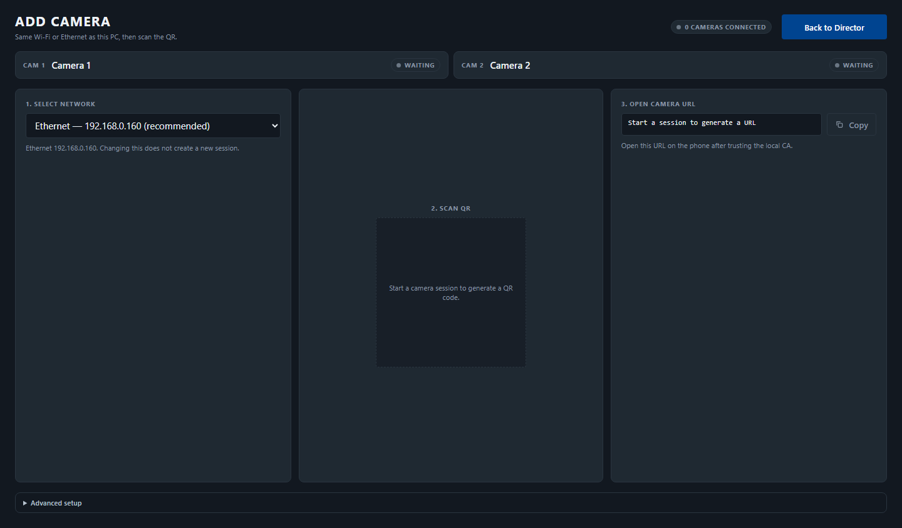

### Interaction States (screens/states/)

*Hover, focus, and active state captures*

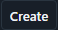

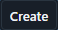

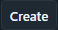


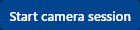

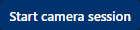

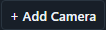


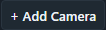

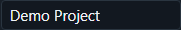

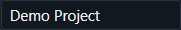


### Screenshot Index (screens/INDEX.md)

# Screenshot Index

## Scroll Journey

> Shows the cinematic state at each point of the page

| Scroll | Y Position | File |
|--------|-----------|------|
| 0% | 0px | `screens/scroll/scroll-000.png` |
| 17% | 0px | `screens/scroll/scroll-017.png` |
| 33% | 0px | `screens/scroll/scroll-033.png` |
| 50% | 0px | `screens/scroll/scroll-050.png` |
| 67% | 0px | `screens/scroll/scroll-067.png` |
| 83% | 0px | `screens/scroll/scroll-083.png` |
| 100% | 0px | `screens/scroll/scroll-100.png` |

## Pages

| Page | URL | File |
|------|-----|------|
| Link Studio | `http://localhost:1420` | `screens/pages/home.png` |

## Sections

| Page | Section | File |
|------|---------|------|
| home | #1 (section) | `screens/sections/home-section-1.png` |

